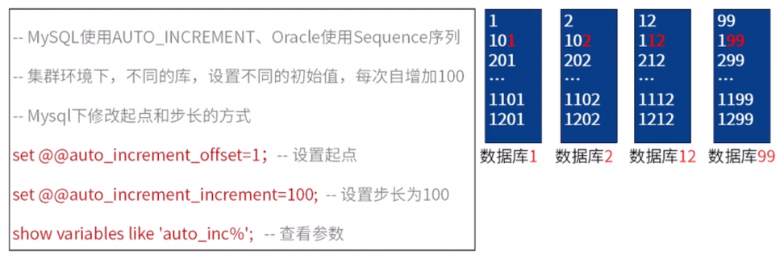
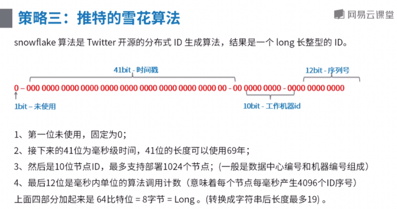
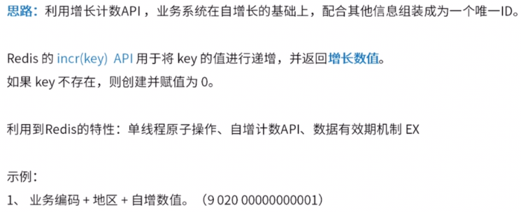
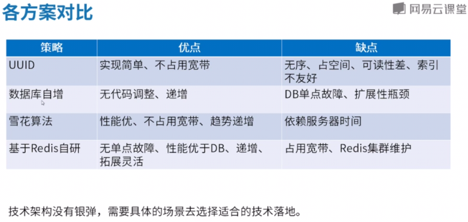

### 了解分布式、高并发下的id生成要求

#### 对id有哪些要求？

​    ①全局唯一    ②趋势递增    ③效率高（生成、使用、索引）    ④控制并发

​    趋势递增：并不要求像1，2，3...一样严格有序递增，只要整体式来看是增长的，有规律可循即可。（一般id为数据库索引，对MySQL中的B+树等比较友好）

​    效率高：生成（每秒生成的id数）、使用（最好是整形的数字，相比字符串更有优势）、索引（对整形有序数字构建索引相比字符串更快，查询也是）

#### 生成id的策略一：UUID（长度为36的字符串）

​    由以当前日期和时间、时钟序列和全局唯一的IEEE机器识别号（一般为MAC地址）等元素组成。

​    优点：①使用简单；②不依赖其他组件；③不影响数据库拓展

​    缺点：①数据库索引效率低；②太过于无意义，用户不友好；③长度36的字符串，空间占用大；④应用集群环境，机器多的时候，重复几率大

#### 生成id的策略二：数据库自增长

​    MySQL中使用AUTO_INCREMENT，Oracle中使用Sequence系列

​    集群环境下，不同的库设置不同的初始值，步长一致。

​    优点：①无需编码；②性能过得去；③索引友好

​    缺点：①大表不能做水平分表，否则插入删除易出现问题；②依赖前期规划，拓展麻烦；③依赖MySQL内部维护“自增锁”，高并发下插入数据影响性能；④在业务操作父、子表（关联表）插入时，要“先父后子”（因为是自增，子表的字段需要根据父表的写入后返回的主键确定）

​    使用场景：数据量较大、不想用程序维护id、方便后续业务迁移的时候

#### 推特的雪花算法

​    优点：①性能较优，速度快；②无需第三方依赖，实现也很简单；③可以根据实际情况调整和拓展算法，方便灵活。

​    缺点：①依赖机器时间，如果发生回拨会导致可能生成id重复，业界一般根据雪花算法进行拓展。

#### 基于Redis自增

​    优点：①扩展性强，可以方便的结合业务进行处理；②利用Redis操作原子性的特性，保证在并发的时候不会重复。

​    缺点：①引入Redis就意味着引入其他第三方依赖；②增加一次网络开销；③需要对Redis服务实现高可用。

​    使用场景：绝大部分id自增场景。

### 了解各种方案使用场景

2.1各方案对比

