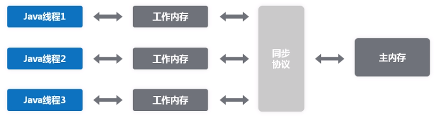
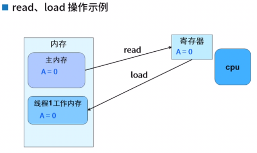
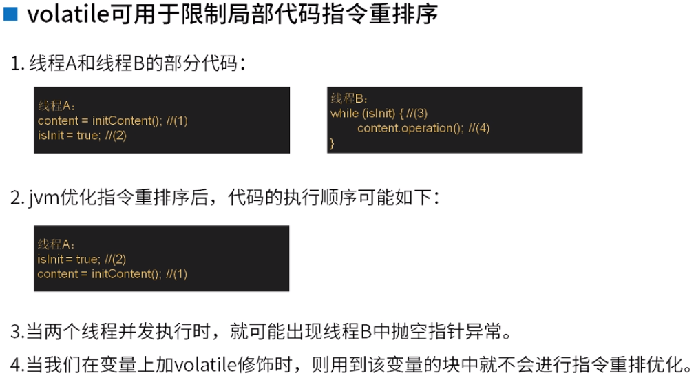
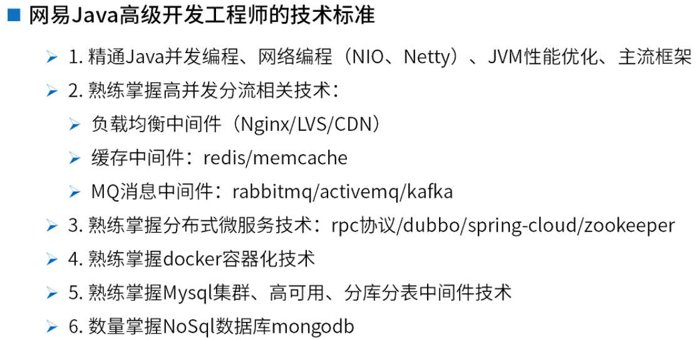

### 本次课程主要内容

1. 掌握并发中变量可见性问题
2. 掌握造成线程安全、变量可见性问题的原因
3. 掌握volatile关键字的用途、使用场景

### 掌握并发中变量可见性问题（多线程时能不能看到变量的最新值）

#### 什么是并发中的变量可见性问题？

2.1.1 变量分类

​	全局变量：成员属性；局部变量：本地变量和参数

2.1.2 如何在多个线程间共享数据

​	用全局变量：静态变量或者共享对象（注意ThreadLocal是用来让线程独享数据的）

2.1.3 一个变量在线程1中被改变值了，在线程2中能看到该变量的最新值吗？

​	经测试，另一个变量不能看到变量的最新值。

#### 不可见的原因及如何才能可见？

2.2.1 为什么不可见？

2.2.2 怎么才能可见？

​	①使用synchronized代码块或方法  ②使用volatile关键字

### 掌握造成线程安全、变量可见性问题的原因

#### Java内存模型

3.1.1 Java内存模型及操作规范

​	①共享变量必须存放在主内存中

​	②线程有自己的工作内存，线程只可操作自己的工作内存

​	③线程要操作共享变量，需从主内存中读取到工作内存，改变值后需从工作内存同步回主内存中

3.1.2 上述内存模型会带来什么问题？

​	读取和同步带来的并发问题？（与预期结果不一致，并不是预期的3）

3.1.3 如何解决上述问题？

​	保证以下几点：①线程1修改后必须立马将共享变量同步回主内存    ②线程2使用共享变量前需重新将其从主内存读取到工作内存    ③线程有先后顺序的执行

3.1.4 使用前不会重新从主内存读取到工作内存吗？

3.1.5 修改后不会立马同步回主内存吗？

#### Java内存同步协议

3.2.1 同步协议中规定了8中原子操作：

​	①lock（锁定）：将主内存中的变量锁定，为一个线程所独占

​	②unlock（解锁）：将lock加的锁定解除，此时其它的线程可以有机会访问此变量

​	③read（读取）：作用于主内存变量，将主内存中的变量读取到工作内存中

​	④load（载入）：作用于工作内存变量，将read读取到的值保存到工作内存中的变量副本中

​	⑤use（使用）：作用于工作内存变量，将变量副本中存的值传递给线程的代码执行引擎

​	⑥assign（赋值）：作用于工作内存变量，将执行引擎处理返回的值重新赋值给变量副本

​	⑦store（存储）：作用于工作内存变量，将变量副本的值回写到主内存中

​	⑧write（写入）：作用于主内存变量，将store传送过来的值写入到主内存的共享变量中

3.2.2 同步协议规范：

​	①将一个变量从主内存复制到工作内存要顺序执行read、load操作；要将变量从工作内存同步回主内存要顺序执行store、write操作。**只要求顺序执行，不一定要连续执行**。

​	②做了assign操作，必须同步回主内存。不能没做assign操作，直接同步回主内存。（**不一定要做完assign后，立即同步回主内存**）

#### 实现变量可见性

3.3.1 保证变量可见性的方式

​	①final变量：常量，不能被修改    ②Synchronized    ③volatile关键字

3.3.2 Synchronized如何实现可见性

​	Synchronized的语义规范：①进入同步块前，先清空工作内存中的共享变量，从主内存中重新加载该变量    ②解锁前必须把修改的共享变量同步回主内存    ③锁机制本身保证不会有多个线程同时操作共享变量

### 掌握volatile关键字的用途、使用场景

4.1.1 volatile规范：

​	①使用volatile变量时，必须重新从主内存加载，并且read、load是连续的

​	②修改volatile变量后，必须立马同步回主内存，并且store、write是连续的

4.1.2 volatile能做到线程安全吗？

​	不能。没有锁机制，中间对数据操作的代码不能保证只有一个线程在执行。

4.1.3 Synchronized能同时保证可见性和线程安全，为什么还要有volatile？

​	①volatile的使用比Synchronized简单    ②volatile性能比Synchronized稍好

4.1.4 volatile还有什么用途？

​	可以限制局部代码的**指令重排**。

4.1.5 volatile的成员变量

​	①只能修饰成员变量（因为本地变量和参数不能多线程共享）

​	②多线程并发下，才需要使用它

​	③只有一个修改者，多个使用者，要求保证可见性的场景（不能有多个修改者，因为不能保证线程安全）

​	④用来做状态标识和数据定期发布

### 小结

5.1 并发变量可见性问题

5.2 可见性、线程安全问题原因 & Java内存模型 & synchronized原理

5.3 volatile原理、用法、用途和应用场景

