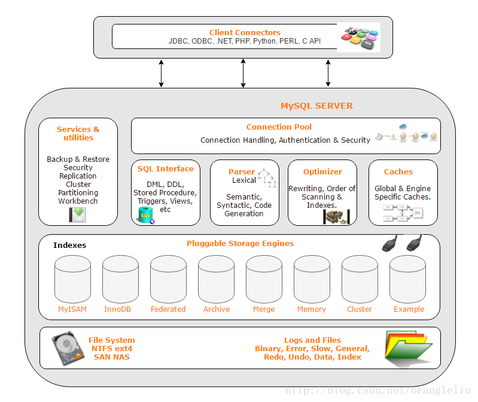
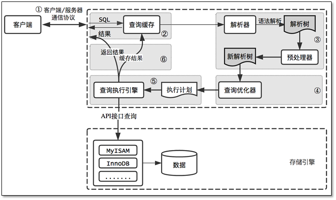
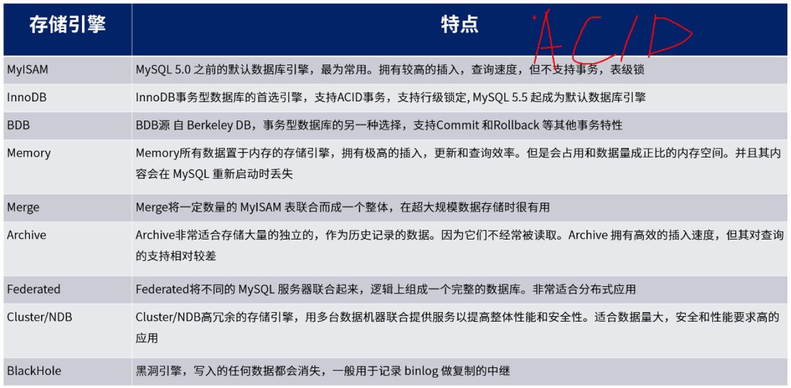
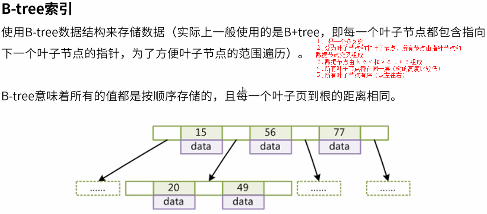
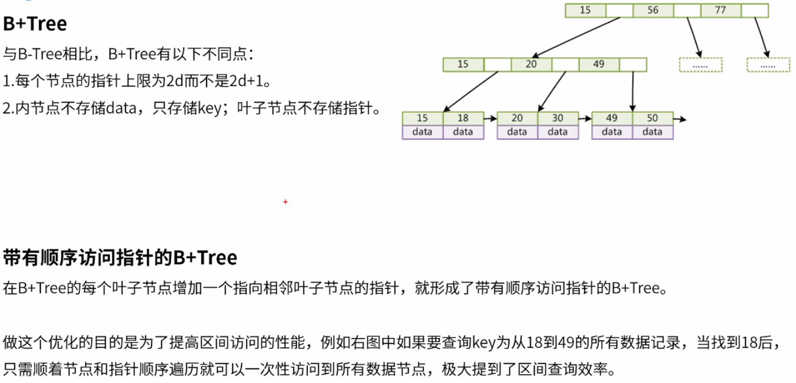
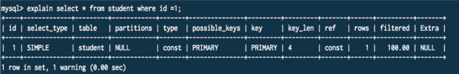

### 课程目标

1. MySQL简介
2. MySQL索引底层结构简介
3.  MySQL Explain执行计划详解

### MySQL简介

#### MySQL基本介绍

1.1.1 MySQL的架构图如下所示，其核心特色有以下三点：

​	①基于文件存储    ②单进程多线程    ③插件式的储存引擎

1.1.2 MySQL优化的角度主要包括以下几方面：

​	①文件系统层    ②操作系统层    ③网络层    ④SQL层

[MySQL优化方案](https://www.cnblogs.com/clsn/p/8214048.html)：讲述了MySQL优化的几个角度。

1.1.3 InnoDB衍生出来的数据库Maria DB

1.1.4 MySQL各种存储引擎之间的比较

​	关键点：索引、事务和分布式存储扩展能力。

1.1.5 数据库事务的ACID特性：

​	①A：原子性，要么整个事务全部成功，要么整个事务全部失败

​	②C：一致性，保证系统始终处于一致的状态

​	③I：隔离性，隔离状态执行事务，使他们好像是当前正在执行的唯一操作

​	④D：持久性，在事务结束后，将该事务对数据库的操作持久化，无法再回滚

1.1.6 MVCC（多版本并发控制）

​	基本原理：通过保存数据在某个时间点的快照来实现。这意味着一个事务无论运行多长时间，在同一个事务里能够看到数据一致的视图。根据事务开始的时间不同，在同一个时刻不同事务看到的相同表里的数据可能是不同的。在MySQL中就是每行数据增加**创建版本号和删除版本号**两个字段（这个只是简单版本的MVCC，与MySQL实际的实现有很大出入）。MVCC只在REPEATABLE READ和READ COMMITED两种隔离级别下有效。

​	基本特征：

​	1. 每行数据都存在一个版本，每次数据更新时都更新该版本。

​	2. 修改时Copy出当前版本随意修改，各个事务之间无干扰。

​	3. 保存时比较版本号，如果成功（commit），则覆盖原记录；失败则放弃copy（rollback）

​	[MySQL中的MVCC（多版本并发控制）](https://www.cnblogs.com/aspirant/p/6920987.html)：这个博主的文章不错，值得多看看！注意点：MySQL的可重复读已经避免了幻读！！

​	[比较完整的MySQL中的MVCC](http://libisthanks.blog.163.com/blog/static/23527612320141016111027592)：使用行记录中的**DATA_TRX_ID**和**DATA_ROLL_PTR**字段，以及事务开始时创建**read_view**来实现MVCC。

​	READ-COMMITTED：事务内的每个查询语句都会重新创建read_view，这样就会产生不可重复读现象发生

​	REPEATABLE-READ：事务内开始时创建read_view， 在事务结束这段时间内 每一次查询都不会重新重建read_view， 从而实现了可重复读。

1.1.7 MyISAM和InnoDB对比

​	聚集索引的定义：数据行的物理顺序与列值（及索引，一般为主键）的逻辑顺序相同，一个表中只能有一个聚集索引。根据聚集索引可以直接查询到需要的数据，而非聚集索引还需要进行二次查询（第一次查询只能获取到对应的索引值，再根据索引值去查询数据）。

### MySQL索引底层结构简介

#### 如何衡量索引的好坏？

​	从时间复杂度和空间复杂度进行考虑。

#### 常用的实现索引的数据结构？

​	①B+Tree索引

 	B-Tree索引

​	B+Tree索引

​	②Hash索引（类似Java中的HashMap，常用于实现缓存）

​	③R-Tree索引（用于存储空间坐标值）

​	④Full-Text索引（存储大文本，分词加倒排表）

#### between……and……的范围查询使用了间隙锁，及其可能引发的问题？

​	间隙锁是MySQL三种锁：行锁、间隙锁和Next-key Lock（行锁和间隙锁的合并）之一，可以防止幻读的发生。用update语句更新范围内的数据，或在REPEATABLE_READ的隔离级别下，删除的数据不存在，则会产生间隙锁。**间隙锁会导致在区间内的数据无法插入**。

### MySQL执行计划简介

3.1 什么是执行计划？

​	执行计划就是MySQL如何执行一条SQL语句，包括查询的顺序、是否使用索引以及使用的索引信息等内容。

3.2 查看执行计划的基本语法？

​	① explain select ……

​	②explain extended select ……

​	③explain partitions select ……

3.3 MySQL的分区表是什么？

​	分区表：所有数据还是在一个表中，但物理存储根据一定的规则放在不同的硬盘或文件中。

​	与分库分表相比，分区表存在以下缺点：

​	①分区键设计不太灵活，如果不走分区键，很容易出现全表锁

​	②一旦数据并发量较大，如果在分区表实施关联，就是一个灾难

​	③分库分表，开发人员可掌握业务场景与访问模式，较为可控；而分区表不太可控

3.4 explain的返回结果

3.5 InnoDB的索引实现

​	一级索引和二级索引（辅助索引）？二级索引能查到的一级索引值，然后再根据一级索引值查数据。与MyISAM的不同是，MyISAM任何索引都是直接关联到数据的。

3.6 key_length的计算公式

