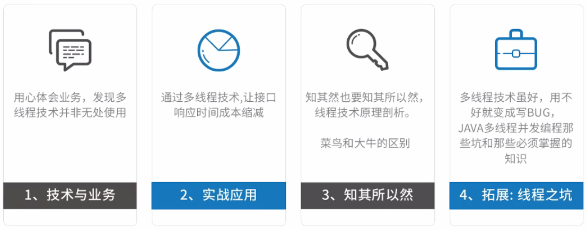
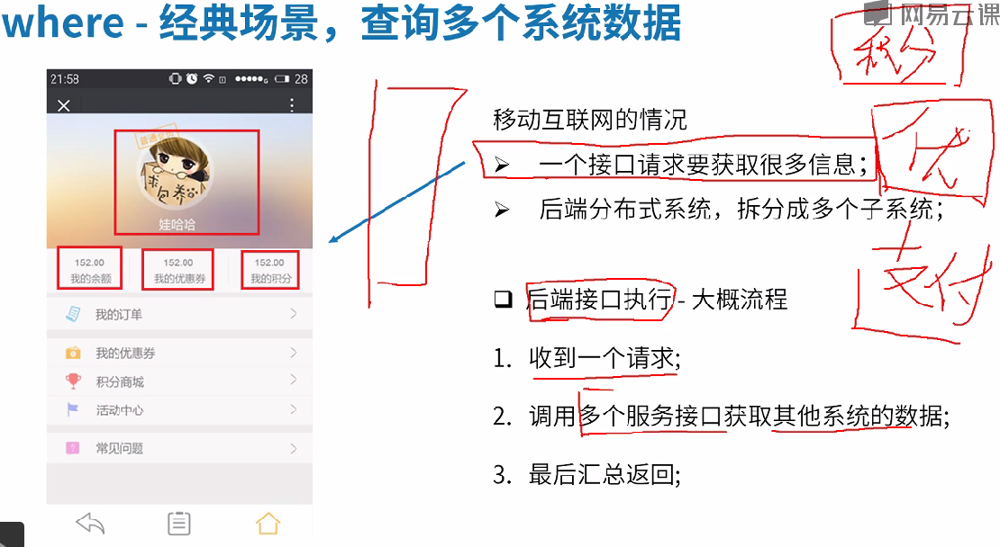
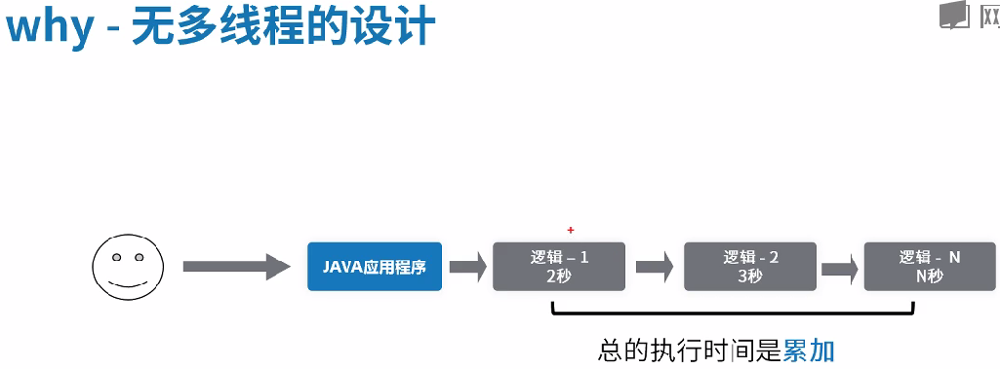
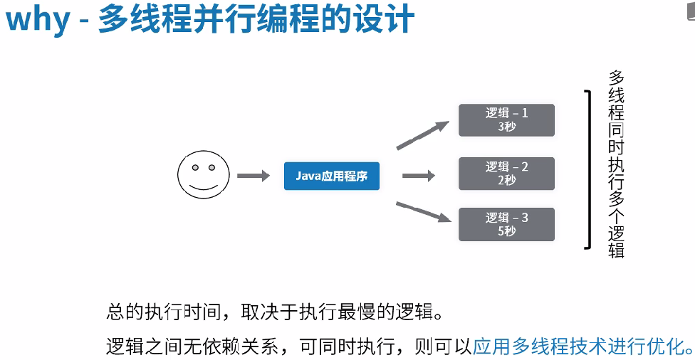

### 课程内容

### 3W1H学习方法

​	What：是什么

​	where：哪里用

​	Why：为什么要用

​	How：怎么做到

### 技术与业务

​	本次课程涉及的业务场景：一个提供给外部的接口需要调用内部的多个接口，**利用多线程技术来减少接口的响应时间**。

​	没有应用多线程的处理方法：

​	应用多线程的处理方法：（前提是没有先后依赖关系）

### 实战应用

2.1 Runnable和Callable的区别？

​	①方法名不同，Callable可以有返回值，并且可以抛出异常。

2.2 Runnable和Callable的联系？

​	①call()实际是通过run()来调用执行的

​	②Runnable实例对象需要Thread包装启动

​	③Callable先通过FutureTask包装（本质还是Runnable），再丢给Thread包装执行

2.3 Callable实现过程：

​	①定义Callable接口中的call()要完成的业务逻辑。

​	②利用FutureTask<T>封装Callable<T>

​	③利用new Thread(FutureTask)启动线程

​	④FutureTask.get()获取线程的执行结果

### 知其所以然

3.1 源码阅读方法

​	①手动抛异常法②断点调试法③官方文档

3.2 利用Runnable和Callable<T>实现自己的FutureTask<T> 

​	主要内容：

​	①成员变量：状态标识、Callable对象、结果储存对象

​	②方法：run()、get()（run()中包含唤醒，get()中包含等待）

### 拓展：线程之坑

4.1 wait()和notifyAll()执行要有先后顺序！

4.2 park()和unpark()解决上述问题